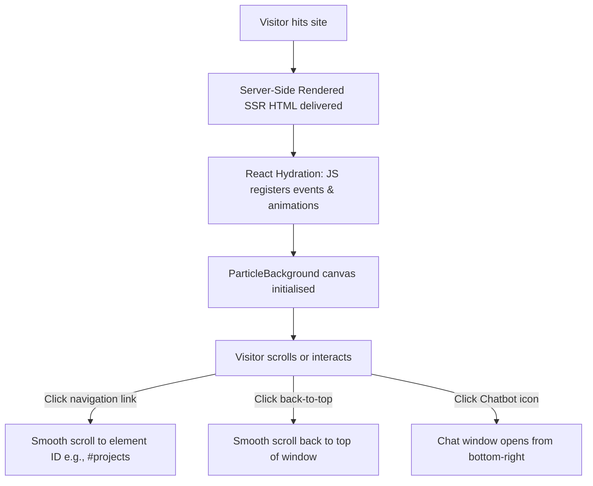
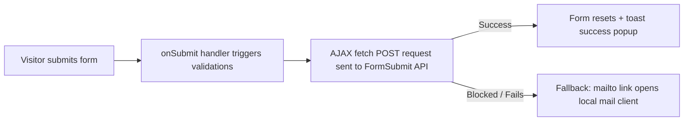

# Project Understanding & Learning Guide: Portfolio Website

This document is a comprehensive guide created for **your learning and understanding only**. It breaks down your portfolio codebase into beginner-friendly explanations, explaining the folder structure, technologies, components, page flow, styling, animations, and deployment setups.

---

## Table of Contents
1. [Project Overview](#1-project-overview)
2. [Technology Stack](#2-technology-stack)
3. [Folder Structure](#3-folder-structure)
4. [Component Breakdown](#4-component-breakdown)
5. [Page Flow & Navigation](#5-page-flow--navigation)
6. [Styling System](#6-styling-system)
7. [Animation System](#7-animation-system)
8. [Resume Download Feature](#8-resume-download-feature)
9. [Social Links Feature](#9-social-links-feature)
10. [Projects Section](#10-projects-section)
11. [Contact Section & Email Flow](#11-contact-section--email-flow)
12. [SEO & Metadata Setup](#12-seo--metadata-setup)
13. [Deployment Configuration](#13-deployment-configuration)
14. [Complete Code Walkthrough (File-by-File)](#14-complete-code-walkthrough-file-by-file)
15. [30 Interview Questions & Answers](#15-30-interview-questions--answers)
16. [Future Improvements](#16-future-improvements)

---

## 1. Project Overview
This project is a high-performance, visually stunning **portfolio website** designed for **Aniket Shantaram Kondhalkar** to showcase his skills as an **AI Engineer, Machine Learning Engineer, and Data Analyst**.

*   **Main Purpose:** To act as an interactive digital resume and project showcase that demonstrates technical proficiency in building intelligent systems, creating dashboards, and hosting live AI applications.
*   **Target Audience:** 
    *   **Recruiters & Hiring Managers:** Looking to verify credentials (certifications) and check past experience.
    *   **Clients/Collaborators:** Looking for developer partners for machine learning, data engineering, or business intelligence projects.
*   **Key Capabilities:** Showcases detailed project summaries, lists verified certificates, hosts an AI chatbot assistant, provides a one-click resume download, and includes an AJAX-powered contact form.

---

## 2. Technology Stack

### A. React (v19)
*   **What it is:** A popular open-source JavaScript library developed by Meta for building user interfaces based on reusable "components."
*   **Why it is used:** Rather than writing duplicate HTML files, React allows us to split the interface into independent blocks (e.g. `Navbar`, `Projects`, `Card`) and dynamic states.
*   **Where it is used:** The entire UI is written in React using Functional Components and React Hooks (`useState`, `useEffect`, `useRef`).

### B. TypeScript
*   **What it is:** A strongly typed programming language that builds on top of JavaScript. Think of it as JS with strict safety check-ups.
*   **Why it is used:** JavaScript is highly permissive and silent about bugs. TypeScript alerts us in the IDE (visual editor) if we try to pass wrong properties (props) or variables, helping prevent compile-time errors.
*   **Where it is used:** Every source file in the `src/` directory ends with `.ts` or `.tsx` and uses types (e.g. `{ children: ReactNode }`).

### C. TanStack Start & Router
*   **What it is:** TanStack Router is a type-safe router for React. TanStack Start is a full-stack framework built on top of it, powered by Vinxi and Nitro, allowing Server-Side Rendering (SSR).
*   **Why it is used:** 
    *   Traditional React apps load a blank HTML file first and construct everything on the client browser (slow load).
    *   TanStack Start compiles the pages on the server and sends fully formed HTML to the browser first, which is excellent for load speed and search engine indexers.
*   **Where it is used:** Configured in `src/routes/` and routes are registered in `src/routeTree.gen.ts`.

### D. Tailwind CSS (v4)
*   **What it is:** A utility-first CSS framework.
*   **Why it is used:** Instead of writing hundreds of lines of separate custom CSS rules in a stylesheet, we style elements by applying preset class names directly in our HTML (e.g., `flex items-center justify-between py-4 px-6`). It provides a highly standardized spacing, color, and responsiveness system.
*   **Where it is used:** Declared globally in `src/styles.css` and applied to elements via `className="..."` throughout components.

### E. Framer Motion
*   **What it is:** A powerful React library for creating fluid, declarative animations.
*   **Why it is used:** Standard CSS transitions can be tedious to code for complex entries. Framer Motion makes it simple to animate elements as they enter the screen, scroll into view, or hover.
*   **Where it is used:** Used as `<motion.div>` in `Hero.tsx`, `About.tsx`, `Projects.tsx`, etc., to configure scroll reveal transitions.

### F. Lucide React
*   **What it is:** A community-run library of clean, vector-based SVG icons.
*   **Why it is used:** Provides a unified set of modern, customizable icons (e.g. `Download`, `Mail`, `Github`, `Linkedin`).
*   **Where it is used:** Imported as components (e.g. `<Mail className="h-4 w-4" />`) across portfolio sections.

### G. Sonner
*   **What it is:** A toast notification library for React.
*   **Why it is used:** Used to display beautiful pop-up notices (toasts) when the user submits the contact form or encounters an error.
*   **Where it is used:** Rendered in `__root.tsx` via `<Toaster />` and called in `Contact.tsx` using `toast.success()`.

---

## 3. Folder Structure

```
Aniket_AI/
├── .git/                      # Git repository logs and history
├── .lovable/                  # Configuration specific to the Lovable compiler
├── public/                    # Static assets served from the root path
│   ├── Aniket_Kondhalkar_Resume.pdf # Your physical PDF resume
│   └── robots.txt             # Search engine crawler permissions
├── src/                       # Main source code directory
│   ├── assets/                # Local images/media used inside components
│   │   └── aniket-portrait.jpg # Hero portrait photo
│   ├── components/            # Reusable React components
│   │   ├── portfolio/         # Individual sections of the portfolio site
│   │   └── ui/                # UI primitives (buttons, inputs) from shadcn/ui
│   ├── hooks/                 # Custom React hooks (e.g. use-mobile.tsx)
│   ├── lib/                   # Internal utilities (theme toggles, error capture)
│   ├── routes/                # File-based TanStack routes
│   │   ├── __root.tsx         # The main root shell wrapper (layout)
│   │   ├── index.tsx          # Home page route template
│   │   └── sitemap[.]xml.ts   # Sitemap XML endpoint
│   ├── routeTree.gen.ts       # Generated TanStack route mappings (Do not edit)
│   ├── router.tsx             # Router setup and client provider
│   ├── server.ts              # TanStack server entries
│   ├── start.ts               # Setup configurations
│   ├── styles.css             # Global stylesheet & Tailwind CSS configurations
│   └── types.d.ts             # Custom TypeScript module declarations
├── bun.lock                   # Package lockfile for Bun runtime
├── bunfig.toml                # Settings for Bun
├── package.json               # Project details, script runners, and dependencies
├── tsconfig.json              # TypeScript compilation rules
└── vite.config.ts             # Bundler configuration file
```

---

## 4. Component Breakdown

Every major section of the portfolio is split into its own React file inside `src/components/portfolio/`. Let's explain what each one does:

### A. `Section.tsx`
*   **Purpose:** A template wrapper that ensures all sections of the page have identical margins, paddings, headers, and scroll offsets.
*   **Props Used:**
    *   `id`: Anchor tag target (used for navigation).
    *   `eyebrow`: Small badge text above the title.
    *   `title`: The section header.
    *   `subtitle`: Small description text below the title.
    *   `children`: The actual HTML content of the section.
*   **Concept:** Uses a `<motion.div>` with `whileInView` to fade sections in smoothly as the user scrolls down.

### B. `Navbar.tsx`
*   **Purpose:** The top navigation bar containing links to sections, the logo (`Aniket.AI`), the theme toggle button (Sun/Moon), and a hamburger menu icon on mobile.
*   **State Used:**
    *   `scrolled`: Boolean (True/False) that turns True when the user scrolls down more than 24px, adding a blurred glass backdrop effect.
    *   `open`: Boolean controlling the mobile slide-down menu visibility.
*   **Key Functions:**
    *   `onScroll`: Listen to the scroll position of the window to toggle the `scrolled` variable state.

### C. `Hero.tsx`
*   **Purpose:** The introduction banner. Displays Aniket's title, descriptive intro, portrait photo, verified location, social buttons, a scroll prompt, and the resume download button.
*   **Assets used:** Imports `aniket-portrait.jpg` directly.
*   **Responsive layout:** Uses Tailwind CSS flex wrapping and responsive grid columns to ensure text is stacked below the photo on mobile and side-by-side on desktop.

### D. `About.tsx`
*   **Purpose:** Displays a short profile summary and maps out 4 visual statistics cards: Projects, Dashboards, Deployed Apps, and Certifications.
*   **Data Object:** `stats` array maps icons to numeric stats.

### E. `Skills.tsx`
*   **Purpose:** Categorizes and displays technical capabilities.
*   **Data structure:** An array of categories (`groups`), each with an icon (e.g. `Code2`, `Brain`, `Cloud`), a title (e.g. "Programming", "Machine Learning"), and an array of individual skill tags (chips).
*   **Visual Styling:** Uses a glass card design that translates slightly upward on hover.

### F. `Projects.tsx`
*   **Purpose:** Lists and highlights portfolio work.
*   **Structure:** Iterates over a array of projects. Generates a grid showing:
    *   Category badges (e.g., "Flagship", "Computer Vision").
    *   Bullets describing core features.
    *   Tech stack chips.
    *   Standard anchor tags to GitHub code repositories and live hosting URLs.

### G. `Experience.tsx`
*   **Purpose:** Showcases professional background (Machine Learning & Data Science Internship at AI Adventures).
*   **Design:** A timelines card presenting the role title, duration badge, company name, and bulleted project details.

### H. `Certifications.tsx`
*   **Purpose:** Displays verified course certifications from AI Adventures training.
*   **Key Feature:** Anchors are generated dynamically pointing directly to AI Adventures verify endpoints (`https://www.aiadventures.in/certificate/?certificate=${c.id}`).

### I. `Education.tsx`
*   **Purpose:** Academic details (Bachelor of Computer Applications degree, timeline, CGPA).

### J. `Contact.tsx`
*   **Purpose:** Contact channels list and message form.
*   **State Used:**
    *   `submitting`: Disables the submit button while sending request.
*   **Key Function:**
    *   `onSubmit`: Submits fields asynchronously to FormSubmit.co using `fetch`. Falls back to a local `mailto:` link if the fetch fails.

### K. `Footer.tsx`
*   **Purpose:** The bottom bar of the site. Contains quick navigation links, social links, and copyright text.

### L. `BackToTop.tsx`
*   **Purpose:** A floating circular button that appears after scrolling down 500px, enabling users to click to scroll instantly back to the top of the page.
*   **State Used:** `show` (controls visibility).
*   **Positioning:** Repositioned to `bottom-24 right-6` to avoid overlapping the chatbot.

### M. `Chatbot.tsx`
*   **Purpose:** An AI chatbot assistant designed to answer recruiter questions.
*   **State Used:**
    *   `open`: Toggles visibility of the chat panel.
    *   `input`: Holds the typed question.
    *   `messages`: Array of messages.
*   **Key Functions:**
    *   `answer()`: A rule-based parser that scans user inputs for keywords (e.g. "projects", "resume", "skills", "certifications") and returns answers featuring clickable standard HTML links opening in new tabs.
    *   `send()`: Appends new messages and updates scroll position.

---

## 5. Page Flow & Navigation

When a user visits the website, the following execution flow occurs:



*   **Hydration:** The process where React attaches event listeners (like button clicks) to the HTML sent from the server.
*   **Internal Navigation:** Uses standard hash anchors (`href="#about"`, etc.) matched with `scroll-mt-24` on section containers. The `scroll-behavior: smooth` CSS directive ensures smooth scrolling transitions.

---

## 6. Styling System

### A. CSS variables & Dark/Light Mode
Tailwind v4 defines its colors, radius, and shadows inside `src/styles.css` using modern OKLCH color space. Dark mode configurations are grouped under the `.dark` class block:

```css
:root {
  --background: oklch(0.985 0.008 230);
  --foreground: oklch(0.17 0.04 270);
  --glass: oklch(1 0 0 / 0.65);
}

.dark {
  --background: oklch(0.12 0.025 275);
  --foreground: oklch(0.97 0.01 250);
  --glass: oklch(0.18 0.03 275 / 0.55);
}
```

*   **OKLCH:** A color format representing lightness (L), chroma (C, saturation), and hue (H).
*   **Implementation:** The `ThemeProvider` class in `src/lib/theme.tsx` monitors the current active mode. By default, it sets the `<html>` element class to `class="dark"`.

### B. Glassmorphism
The premium look is powered by custom `@utility glass` in `styles.css`:
```css
@utility glass {
  background: var(--color-glass);
  backdrop-filter: blur(18px) saturate(140%);
  border: 1px solid var(--color-glass-border);
}
```
This utility adds a semi-transparent background, blurs whatever is behind it, and applies a subtle glowing border.

### C. Responsive Utility Classes
We achieve responsive design via breakpoint prefixes:
*   `w-full max-w-[320px] sm:w-[360px]` -> On small devices, take up full width up to 320px; on `sm` (small tablets/screens > 640px), fix the width to 360px.
*   `grid gap-6 md:grid-cols-2 lg:grid-cols-3` -> Stacks items in 1 column by default (mobile), 2 columns on medium screens (`md` > 768px), and 3 columns on large screens (`lg` > 1024px).

---

## 7. Animation System

Framer Motion is configured inline. It intercepts components and handles transitions:

### A. Reveal Animations (Fade & Slide)
```typescript
<motion.div
  initial={{ opacity: 0, y: 20 }}
  whileInView={{ opacity: 1, y: 0 }}
  viewport={{ once: true }}
  transition={{ duration: 0.5 }}
>
```
*   `initial`: The starting state of the component (invisible, offset down by 20px).
*   `whileInView`: Triggers when the user scrolls the component into view (fades to full opacity, slides up to its natural position).
*   `viewport={{ once: true }}`: Tells Framer Motion to run the animation only the first time the item is scrolled into view (avoiding repeated entry transitions).

### B. Floating Animation (Keyframes)
The portrait photo floats gently via a CSS keyframe defined at the bottom of `styles.css`:
```css
@keyframes float {
  0%, 100% { transform: translateY(0); }
  50% { transform: translateY(-12px); }
}
.animate-float { animation: float 6s ease-in-out infinite; }
```

---

## 8. Resume Download Feature

*   **How it works:** Browsers can download static assets using standard anchor links with the `download` attribute:
    ```html
    <a href="/Aniket_Kondhalkar_Resume.pdf" download="Aniket_Kondhalkar_Resume.pdf">
    ```
*   **Pathing:** The file is located at `public/Aniket_Kondhalkar_Resume.pdf`. The `public` directory is mapped directly to the server root, meaning it is accessible at the path `/Aniket_Kondhalkar_Resume.pdf`.
*   **Replacing the Resume:**
    1.  Create your new resume PDF.
    2.  Rename the new document file to `Aniket_Kondhalkar_Resume.pdf`.
    3.  Copy/Replace it inside the `public/` directory, overwriting the existing file.
    4.  Commit and push to update the deployed version.

---

## 9. Social Links Feature

All social links are configured to open in a new browser tab without getting blocked or loaded as embedded pages inside frames:
*   **Anchors:**
    ```html
    <a href="https://github.com/..." target="_blank" rel="noopener noreferrer">
    ```
*   `target="_blank"`: Opens the link in a new browser tab.
*   `rel="noopener noreferrer"`: A critical security attribute that prevents the opened page from accessing our website's window context (`window.opener`), protecting users against phishing redirects.

---

## 10. Projects Section

Each project card displays descriptive details and interactive buttons:
*   **Data Source:** Declared locally as the `projects` object array at the top of `Projects.tsx`.
*   **Layout:** Built as a responsive CSS grid (`grid gap-6 md:grid-cols-2`).
*   **Action Buttons:** Built conditionally based on whether a link is provided:
    ```typescript
    {p.github && ( <a href={p.github} target="_blank"> ... </a> )}
    ```

---

## 11. Contact Section & Email Flow

The contact form is connected to **FormSubmit.co** for zero-config email routing:



*   **Endpoint:** `https://formsubmit.co/ajax/Aniketkondhalkar4717@gmail.com`.
*   **Verification:** First-time submissions require clicking an email verification link sent to `Aniketkondhalkar4717@gmail.com` to prevent spam. Once confirmed, submissions deliver form data directly to your inbox.

---

## 12. SEO & Metadata Setup

SEO configurations reside in `__root.tsx` and `index.tsx`.

### A. Meta Tags
*   `viewport`: Ensures correct page width and scaling on mobile screens.
*   `canonical`: Set to `https://aniket.ai/` to tell Google this is the primary, authoritative URL of the site, preventing duplicate content issues.
*   `description` & `keywords`: Used by search engine result pages.

### B. Open Graph (OG) & Twitter Cards
*   Provides preview titles, descriptions, and images when the link is shared on platforms like LinkedIn, Slack, and X.
*   **Absolute URLs:** The meta tags require absolute sharing URLs (e.g. `https://aniket.ai/assets/...`) so external crawlers can access the image preview file.

### C. Sitemap.xml & Robots.txt
*   **Sitemap (`sitemap[.]xml.ts`):** Automatically maps out your pages (`https://aniket.ai/`) in XML format.
*   **Robots.txt (`robots.txt`):** Points indexers directly to the sitemap:
    ```
    Sitemap: https://aniket.ai/sitemap.xml
    ```

---

## 13. Deployment Configuration

*   **GitHub Integration:** Git tracks changes and publishes them to your remote GitHub repository (`https://github.com/Aniket-k-17/Aniket_AI`).
*   **Vercel / Netlify Setup:**
    1.  Connected to the repository.
    2.  Configures the build command to `npm run build` and publish directory to `dist/client/`.
    3.  Runs build automatically on every push, compiling the static assets.

---

## 14. Complete Code Walkthrough (File-by-File)

### A. `src/routes/__root.tsx`
*   **Purpose:** The layout shell of the entire website.
*   **Key Code:**
    *   `createRootRouteWithContext<{ queryClient: QueryClient }>()`: Sets up TanStack Router contextual references.
    *   `head()`: Defines core meta tags, Google font links, and Person JSON-LD structured data.
    *   `RootShell()`: Declares HTML tag lang, embeds head context, and renders scripts.
    *   `RootComponent()`: Embeds react-query client, theme state wrapper, and page router Outlet.

### B. `src/routes/index.tsx`
*   **Purpose:** The entry home page template.
*   **Key Code:**
    *   `createFileRoute("/")`: Sets up the home route.
    *   `Index()`: Renders sections (Hero, About, Skills, Projects, Experience, Certifications, Education, Contact, Footer, Chatbot) inside a main scroll frame.

### C. `src/components/portfolio/Hero.tsx`
*   **Purpose:** Renders the opening page header and visual greeting.
*   **Key Code:**
    *   `import portraitImg from "@/assets/aniket-portrait.jpg"`: Loads the portrait photo.
    *   `<a href="/Aniket_Kondhalkar_Resume.pdf" download="Aniket_Kondhalkar_Resume.pdf">`: Serves the static PDF download.

### D. `src/components/portfolio/Chatbot.tsx`
*   **Purpose:** Chat interface with rule-based assistant responses.
*   **Key Code:**
    *   `answer()`: Scans strings using Regex and returns matching replies:
        ```typescript
        if (/contact|email|phone/.test(q)) return { text: "📧 <a href='mailto:...'>..." }
        ```
    *   `dangerouslySetInnerHTML`: Renders bot message text as HTML strings, turning inline tags into interactive links.

### E. `src/components/portfolio/Contact.tsx`
*   **Purpose:** Renders the form inputs and maps social handle tags.
*   **Key Code:**
    *   `fetch("https://formsubmit.co/ajax/Aniketkondhalkar4717@gmail.com", ...)`: Submits email form payload asynchronously.

---

## 15. 30 Interview Questions & Answers

### 1. Why did you choose React for this portfolio?
**Answer:** React allows for modular, component-based development. Instead of writing duplicate HTML and manually updating DOM text, we declare components like `Projects` once and let React update the UI efficiently based on state.

### 2. What is TanStack Start and how does it differ from a standard React SPA?
**Answer:** A standard React Single Page Application (SPA) serves a blank index.html page and loads JavaScript to construct elements on the client side. TanStack Start supports Server-Side Rendering (SSR). It compiles the page on the server and sends fully constructed HTML to the browser, improving initial load speed and SEO indexability.

### 3. How does the sitemap endpoint work in TanStack Start?
**Answer:** In `src/routes/sitemap[.]xml.ts`, we define a server-only handler for the GET method. When a crawler requests `/sitemap.xml`, the server dynamically constructs the sitemap XML string and sends it with the header `Content-Type: application/xml`.

### 4. What is the role of `routeTree.gen.ts`?
**Answer:** It is a generated mapping file created by TanStack Router that keeps track of the folders in `src/routes/`. It provides full compile-time type safety for routes and sitemaps.

### 5. Why do we write code in TypeScript instead of vanilla JavaScript?
**Answer:** TypeScript helps catch errors during development. By defining strict types (e.g. `Props` and interfaces), the IDE will highlight errors immediately if we pass incorrect arguments to a component.

### 6. How does dark mode work in this project?
**Answer:** We use a `ThemeProvider` that adds the class `dark` to the `<html>` root element. Inside `styles.css`, we map our custom color variables (like background and text) to OKLCH values for both light and dark mode classes. Tailwind automatically applies the appropriate colors.

### 7. What is OKLCH color space and why use it?
**Answer:** OKLCH represents colors using lightness, chroma, and hue. It is more perceptually uniform than RGB or HSL, meaning color transitions look smoother, and it provides better color matching when designing dark modes.

### 8. Explain the resume download implementation and how you fixed the UUID naming bug.
**Answer:** Previously, the PDF was imported as a Vite asset, resolving to an internal development path like `/@fs/C:/Users/...`. This caused Chrome to rename the download to a temporary UUID. By moving the PDF back to the `public/` directory and linking it as `/Aniket_Kondhalkar_Resume.pdf`, we ensure the browser downloads it with the correct name.

### 9. Why do we add `rel="noopener noreferrer"` to external links?
**Answer:** It prevents the newly opened tab from referencing our website's window context (`window.opener`). This protects users from malicious redirect attacks.

### 10. How does the contact form send emails without a custom backend?
**Answer:** It uses **FormSubmit.co**, a free service that accepts AJAX POST requests with JSON payloads and forwards them to a configured email address (`Aniketkondhalkar4717@gmail.com`).

### 11. What is the fallback contact mechanism if the API call fails?
**Answer:** If the `fetch` request fails (e.g. blocked by an adblocker), the `catch` block intercepts the error and opens the user's default local email client via a pre-filled `mailto:` link.

### 12. How does Framer Motion coordinate animations on scroll?
**Answer:** We wrap elements in `<motion.div>` and use properties like `whileInView={{ opacity: 1 }}` and `viewport={{ once: true }}`. Framer Motion tracks the viewport scroll position and triggers transitions when the element enters the screen.

### 13. What is the purpose of `robots.txt`?
**Answer:** It is a text file placed in the `public/` folder that tells search engine crawler bots which paths they are allowed to index on your site, and links to your sitemap location.

### 14. What is a canonical URL and why is it important?
**Answer:** A canonical URL (`<link rel="canonical">`) tells search engines the primary address of the page. This prevents search engines from indexing duplicate listings if your portfolio is hosted on multiple domains.

### 15. How are the social icons implemented?
**Answer:** We import icons from `lucide-react` as React components (e.g. `<Linkedin />`) and style them using Tailwind classes (`h-4 w-4`).

### 16. Why are the contact button and chatbot button shifted in layout?
**Answer:** Both the "Back to Top" button and the chatbot toggle were originally positioned at `bottom-6 right-6`. By shifting the "Back to Top" button to `bottom-24`, they no longer overlap, improving usability.

### 17. How does the chatbot answer questions?
**Answer:** It uses a rule-based parser that matches keywords in the user's input. It processes answers as HTML using `dangerouslySetInnerHTML` to render clickable links.

### 18. Is `dangerouslySetInnerHTML` safe to use in the chatbot?
**Answer:** Yes, because the chat replies are hardcoded in the source file. There is no user-controlled input rendered as HTML, which eliminates the risk of Cross-Site Scripting (XSS) attacks.

### 19. How did you optimize the hero image load speed?
**Answer:** The image tag uses `loading="eager"` and `fetchpriority="high"` (implied by eager loading) to ensure the browser prioritizes downloading the portrait photo, minimizing the Largest Contentful Paint (LCP) metric.

### 20. How is responsiveness achieved on the hero portrait photo?
**Answer:** The photo uses `w-full max-w-[320px] object-cover`. This allows the image to scale down responsively on narrow mobile screens (e.g. iPhone SE) rather than overflowing the viewport.

### 21. What is the purpose of `package.json`?
**Answer:** It is the manifest file for the Node/npm project. It defines metadata, script shortcuts (like `npm run dev`, `npm run build`), and dependencies.

### 22. What does `bun.lock` do?
**Answer:** It locks the exact versions of the installed dependencies to ensure the project builds identically across different machines.

### 23. What is the role of `vite.config.ts`?
**Answer:** It configures the Vite bundler, typescript path alias configurations, and SSR routing plugins.

### 24. What is the purpose of `eslint.config.js`?
**Answer:** It contains rules for ESLint, which checks your code for patterns that could lead to bugs or violate stylistic guidelines.

### 25. How would you integrate a database into this project?
**Answer:** Since TanStack Start has server capabilities, we could add server-side handlers in the `routes` folder to connect to a database client (like Prisma or PostgreSQL) and fetch or save data dynamically.

### 26. What does `skipLibCheck: true` mean in `tsconfig.json`?
**Answer:** It tells the TypeScript compiler to skip checking type definitions in node modules (`node_modules`), which speeds up compilation times.

### 27. How does the theme provider remember user preferences?
**Answer:** It saving the active theme state ("light" or "dark") in the browser's `localStorage` and reads it when the page loads, preserving the theme choice across sessions.

### 28. Explain what glassmorphism is.
**Answer:** It is a design trend characterized by semi-transparent elements with a frosted glass look, achieved using `backdrop-filter: blur()`, opacity, and subtle borders.

### 29. How does the sitemap BASE_URL affect SEO?
**Answer:** Sitemaps require absolute URLs. Setting `BASE_URL` to `https://aniket.ai` ensures search engine bots can resolve sitemap paths correctly.

### 30. How would you implement internationalization (i18n) for multiple languages?
**Answer:** We could use a library like `react-i18next`. We would split our content into JSON translation files and use a React context hook to swap strings dynamically based on the user's selected language.

---

## 16. Future Improvements

### A. Beginner-Friendly
*   **Skill Categories filter:** Add buttons to the Skills section to filter tags by category (e.g., show only Cloud or only Programming).
*   **Certified credentials count:** Dynamically compute the size of the certifications array and update the stats section automatically.

### B. Intermediate
*   **Project Detail Page:** Use TanStack Router's dynamic routing to create custom sub-pages for projects (e.g. `/projects/insight-ai`).
*   **Contact Form spam protection:** Add a CAPTCHA (like Cloudflare Turnstile or Google reCAPTCHA) to prevent bot spam submissions.

### C. Advanced
*   **LLM Chatbot Integration:** Replace the rule-based chat logic with an actual API call to an LLM (such as Gemini) to answer questions dynamically.
*   **Continuous Deployment Analytics:** Integrate Google Analytics or Vercel Web Analytics to track site traffic, clicks, and page speed.
